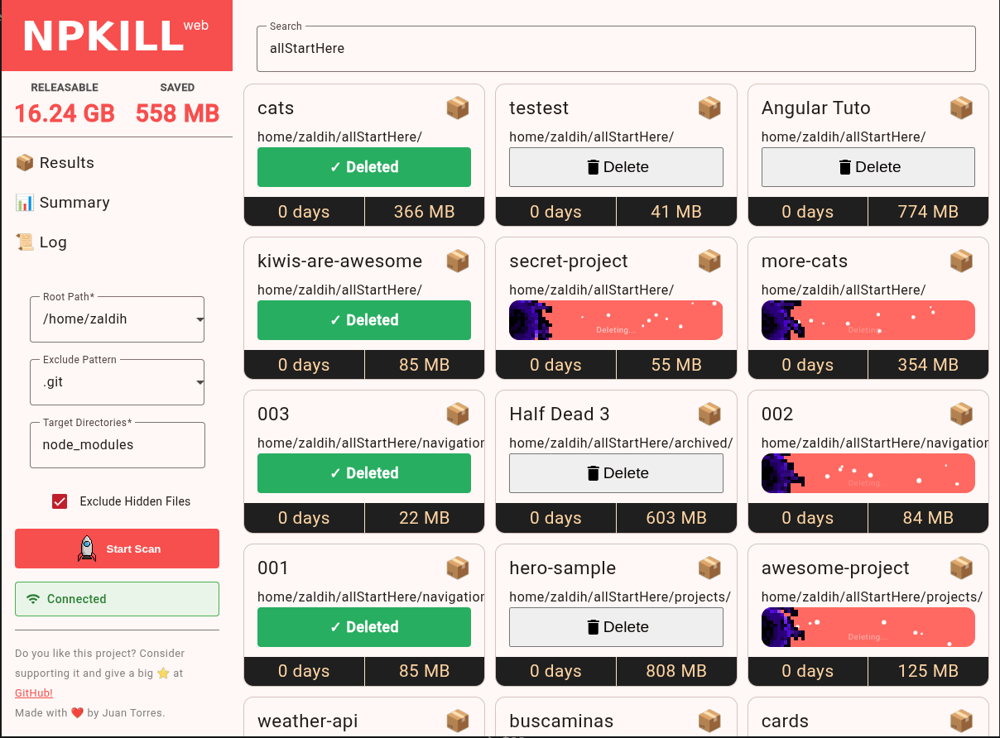
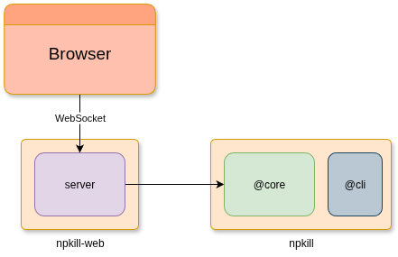

# npkill-web

**Npkill in the browser**.

This is a work-in-progress project to bring [Npkill](https://github.com/voidcosmos/npkill) functionality to the web browser. The goal is to allow users to manage and delete node_modules directories directly from their browser, leveraging the convenience and accessibility of web technologies.

## How its work

## Project Status

Please stay tuned for future updates.
